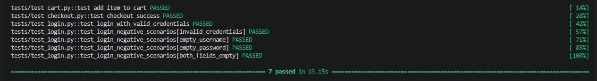

[](https://github.com/prismotta/qa-automation-python/actions)

# QA Automation - Python + Playwright

Projeto de automação de testes E2E utilizando Python, Playwright e Pytest, aplicando o padrão Page Object Model (POM) e integração contínua com GitHub Actions.

## Demonstração da execução dos testes

Abaixo está um exemplo da execução automatizada dos cenários de teste.



---

## Objetivo do Projeto

Este projeto foi desenvolvido com o objetivo de praticar automação de testes E2E utilizando Python e Playwright, aplicando boas práticas de organização, reutilização de código, rastreabilidade de testes e integração contínua.

---

## Tecnologias Utilizadas

- Python
- Playwright
- Pytest
- Git
- GitHub Actions

---

## Estrutura do Projeto

```text
qa-automation-python
├── .github
│   └── workflows
├── assets
│   └── test-execution.png
├── pages
│   ├── login_page.py
│   ├── inventory_page.py
│   └── checkout_page.py
├── tests
│   ├── test_login.py
│   ├── test_cart.py
│   └── test_checkout.py
├── conftest.py
├── pytest.ini
├── requirements.txt
└── README.md
```

---

## Casos Automatizados

### Login

- CT-LOGIN-001 — Login com credenciais válidas
- CT-LOGIN-002 — Login com usuário inválido
- CT-LOGIN-003 — Login com senha inválida
- CT-LOGIN-004 — Login com campos obrigatórios vazios

### Carrinho

- CT-CART-001 — Adicionar item ao carrinho

### Checkout

- CT-CHECKOUT-001 — Finalizar checkout com sucesso

---

## Estratégia de Execução

O projeto utiliza marcadores do Pytest para separar diferentes conjuntos de testes.

### Smoke Tests

Executados em Pull Requests para validar rapidamente os fluxos críticos da aplicação.

```bash
pytest -m smoke
```

### Regression Tests

Executados na branch principal para garantir uma validação mais ampla da aplicação.

```bash
pytest -m regression
```

Essa estratégia reduz o tempo de feedback durante o desenvolvimento e melhora a eficiência do pipeline de integração contínua.

---

## Como Executar o Projeto

### Instalar as dependências

```bash
pip install -r requirements.txt
```

### Instalar os navegadores do Playwright

```bash
playwright install
```

### Executar todos os testes

```bash
pytest
```

### Executar apenas Smoke Tests

```bash
pytest -m smoke
```

### Executar apenas Regression Tests

```bash
pytest -m regression
```

---

## Integração Contínua

Os testes são executados automaticamente via GitHub Actions.

- Smoke Tests em Pull Requests
- Regression Tests na branch principal

---

## Aprendizados

Durante o desenvolvimento deste projeto foram aplicados conceitos de:

- Automação E2E com Playwright
- Testes automatizados com Pytest
- Page Object Model (POM)
- Organização e rastreabilidade de casos de teste
- Integração contínua com GitHub Actions
- Separação de Smoke e Regression Tests
- Estruturação de projetos de automação

---

## Autora

**Priscila Motta**

- LinkedIn: [linkedin.com/in/prismotta](https://www.linkedin.com/in/prismotta)
- GitHub: [github.com/prismotta](https://github.com/prismotta)